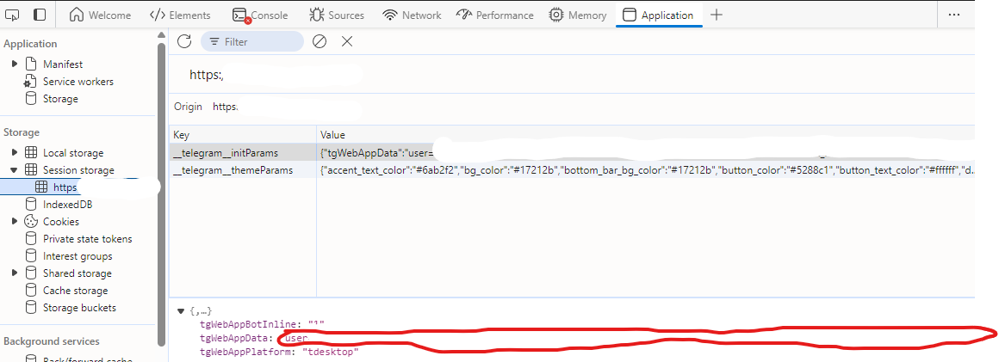

# All The Zen BOT

| ✅  | Feature                               |
| --- | ------------------------------------- |
| ✅  | Automates buy/claim fancy eggs        |
| ✅  | Automates claim big egg               |
| ✅  | Automates claim purple/red/yellow cat |
| ✅  | Automates claim pumpskin spice event  |
| ✅  | Handles multiple accounts             |
| ✅  | Proxy support                         |


## For suggestions or to report a bug, please contact [telegram](https://t.me/al3xhuynh)

## Installation

1. Clone the repository:

   - Open your terminal or command prompt.
   - Navigate to the directory where you want to install the bot.
   - Run the following command:
     ```
     git clone https://github.com/htquangg/allthezenbot.git
     ```
   - This will create a new directory named `allthezenbot` with the project files.

2. Navigate to the project directory:

   - Change into the newly created directory:
     ```
     cd allthezenbot
     ```

3. Install the required dependencies:

   ```
   npm install
   ```

4. Open the `data.txt` file in a text editor and add your account tgWabAppData, one per line:

   ```
   account_1_here
   account_2_here
   account_3_here
   ```

5. If you need to use proxies, fill in the `proxy.txt` file with your proxy addresses, one per line. If not, you can leave this file empty. [example](proxy-example.txt)

## How to Get Your Account tgWabAppData

To obtain your account tgWabAppData:

1. Log in to the AllTheZen app in Telegram or Telegram Web.
2. Open your browser's Developer Tools (usually F12 or right-click and select "Inspect").
3. Go to the "Application" tab in the Developer Tools.
4. Copy tgWabAppData highlighted in red



5. Copy this tgWabAppData and paste it into your `data.txt` file.

**Important**: Keep your account tgWabAppData secret and never share it publicly. It provides access to your account.

## Usage

To run the bot, use the following command in your terminal:

```
node allthezen.js
```

## Disclaimer

This bot is for educational purposes only. Use it at your own risk and make sure you comply with the terms of service of the AllTheZen platform.

## License

See the [LICENSE](https://github.com/htquangg/allthezenbot/blob/main/LICENSE) file for more info.

## 🎁 Donate

<div style="display: flex; gap: 20px;">
  
</div>
